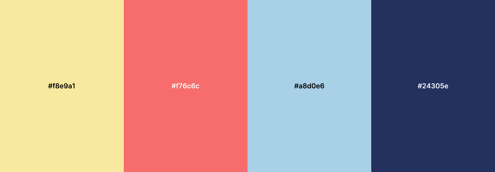

This repository contains all the necessary files for my website portfolio, my very first website!

Check it out here! [la1qa.github.io](https://la1qa.github.io/)

I’m excited to dive into HTML, CSS, and JavaScript to create a portfolio that is not only visually appealing but also efficient, engaging, and informative. I’ll be using Git locally and pushing updates to GitHub, a workflow I’m revisiting and plan to integrate regulary from now on.

The palette I have chosen is the following:

<!--
#ffffff
#f8e9a1
#f76c6c
#a8d0e6
#24305e  
#222222
-->

<!--
https://pixelied.com/colors/palette-editor/f8e9a1-f76c6c-a8d0e6-24305e-ffffff-222222
-->

### Goals for the website:
- Both Dark&Light mode
- Nice transitions
- Catalan&English (Spanish?)
- Spotify